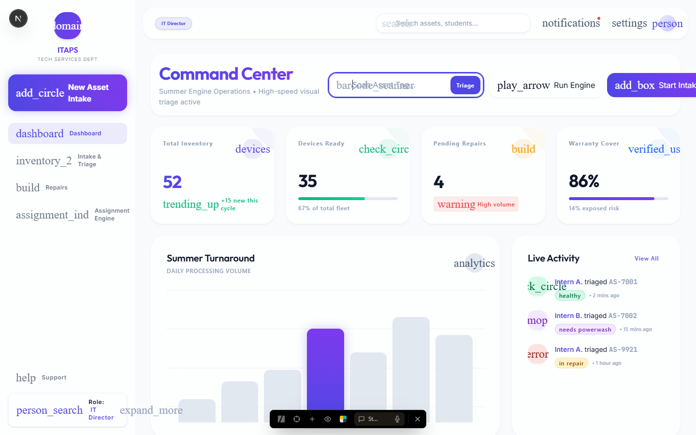
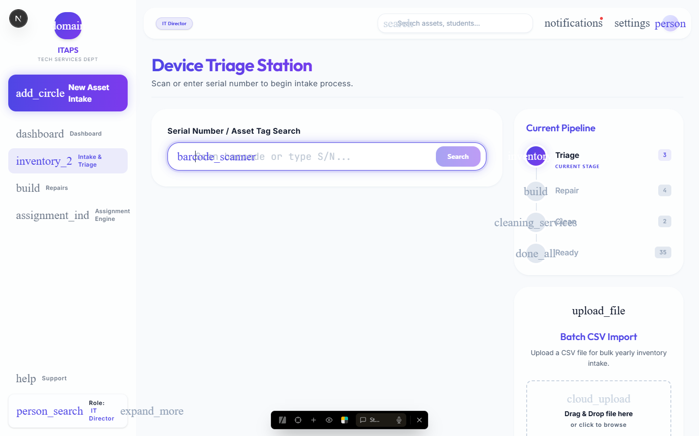
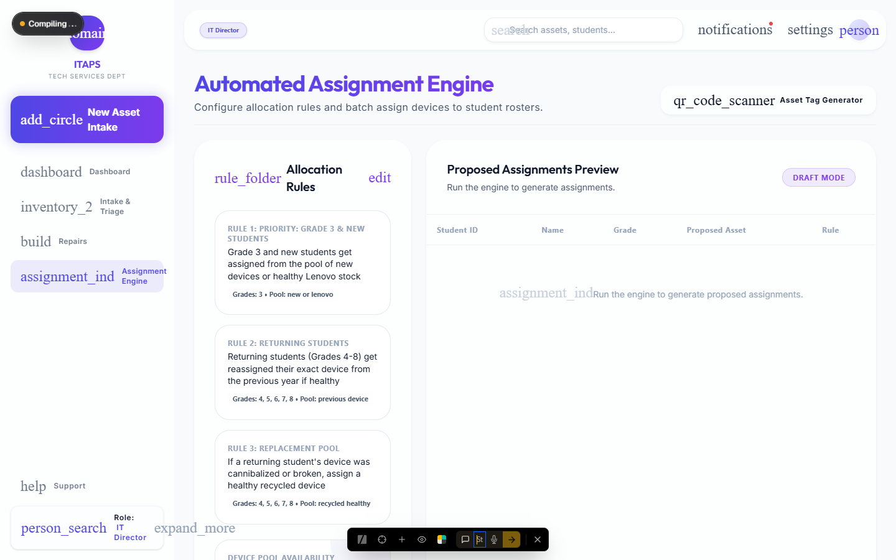

# ⚡ ITAPS // The Turnaround Engine

**Triage. Repair. Deploy.**  
*Inventory isn't real until it's assigned.*







ITAPS is a **unified, high-speed inventory network** built for the modern **IT Department**.  

Unlike traditional platforms (spreadsheets, basic inventory trackers) that treat devices as static rows, ITAPS bridges the **Hardware** (physical asset) and the **Workflow** (live triage and assignment). Every asset is a living, functional entity — complete with repair history, health status, and real-world deployment data.

## 👁️ The Vision

We believe workflow context is just as important as the data itself. For IT Interns, Store Managers, and SysAdmins:

- Experience **high-speed barcode ingestion**
- Execute **live deployments and repairs**
- Discover **hardware insights** (battery health, repair frequency, turnaround velocity)

> **"Stark Functionality"** — Honesty in design through visible grids, speed in sharp edges, and power in high contrast. The Summer Engine gets out of the way.

### Brand Palette & Principles
- **Electric Indigo** `#4F46E5` — Primary actions & accents
- **Vibrant Violet** `#7C3AED` — Secondary highlights
- **Stark White** `#FFFFFF` — Background & primary text
- High density. Sharp. Functional. Built for barcode scanners.

## 🛠️ Core Features

### 1. Intake Hub (Triage Engine)
Streamlined workflow for rapid device inspection.

- **High-Speed Ingestion** → Optimized for barcode scanners, no manual typing required
- **Auto-Triage** → Smart routing for repairs, cleaning, or direct assignment based on condition
- **Quality Scoring** → Standardized condition grading

### 2. Assignment Engine (Deployment System)
Automated batch processing for summer turnaround.

- **Batch Processing** → Process hundreds of devices for summer turnaround
- **Velocity Tracking** → Surfaces bottlenecks and deployment speed
- Metrics updated in real-time

### 3. Repair Bay (Asset Diagnostics)
Technical passports meets RPG character sheets.

- **Hardware Dossier** → Complete repair history per asset
- **Donor System** → Cannibalize broken units for parts efficiently
- **Live Commands** → Real-time device status updates

### 4. God Mode (Director Panel)
Terminal-style control center for operators.

- Immutable security audit logs
- Role-Based Access Control (RBAC)
- High-fidelity incident tools

## 💻 Tech Stack

| Layer          | Technology                          |
|----------------|-------------------------------------|
| Frontend       | Next.js 16 (App Router)             |
| Styling        | Tailwind CSS 4                      |
| Animations     | Framer Motion                       |
| Backend/DB     | Express.js / SQLite                 |
| Realtime       | WebSocket Integration               |
| Validation     | Zod                                 |
| Typography     | Outfit / JetBrains Mono             |

## 🚀 Getting Started

### 1. Environment Setup
```bash
git clone https://github.com/your-repo/itaps.git
cd itaps
```

### 2. Installation
- **For the Backend:**
  ```bash
  cd server
  npm install
  ```
- **For the Frontend:**
  ```bash
  cd app
  npm install
  ```

### 3. Run the Servers
```bash
# Terminal 1 - Backend
cd server
npm run dev

# Terminal 2 - Frontend
cd app
npm run dev
```

## 📡 Protocol Roadmap

| Phase                  | Focus                                      |
|-----------------------|--------------------------------------------|
| **Phase 1**           | Core UI + Modern Premium Light Design System |
| **Phase 2**           | Intake Hub — High-speed scanner integration |
| **Phase 3**           | Repair Bay — Parts cannibalization and tracking |
| **Phase 4**           | Assignment Engine — Batch processing and deployment |
| **Phase 5**           | Global Dashboard — Analytics and velocity metrics |

## 🤝 Contribution Protocol

We welcome contributors who vibe with the ITAPS aesthetic.

1. Fork the repository
2. Create a feature branch: `git checkout -b feature/YourFeature`
3. Commit: `git commit -m 'feat: YourFeature description'`
4. Push: `git push origin feature/YourFeature`
5. Open a Pull Request

---

**[Application URL](http://localhost:3000)** · **[Report Issue](https://github.com/your-repo/itaps/issues)**

Built with precision. Deployed with intent.  

## ⚖️ License

**ITAPS** is source-available. 

- **Personal/Educational Use**: Feel free to fork, modify, and use this for your personal projects.
- **Commercial Use**: Prohibited without prior written consent. If you intend to use this code for a paid product, startup, or commercial venture, you must contact the author.

Licensed under the [Polyform Noncommercial 1.0.0](LICENSE).

**ITAPS // The Turnaround Engine**